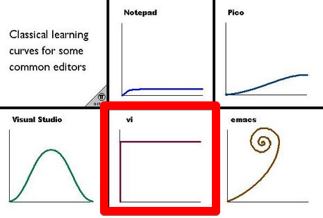
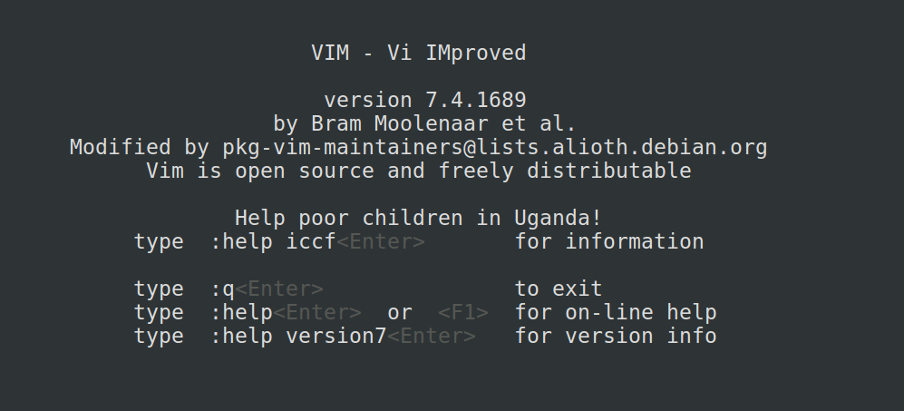
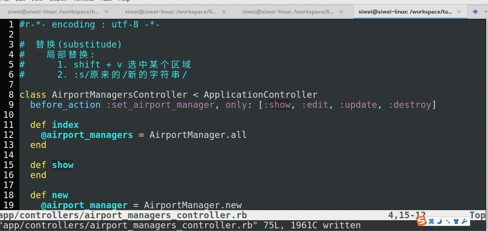
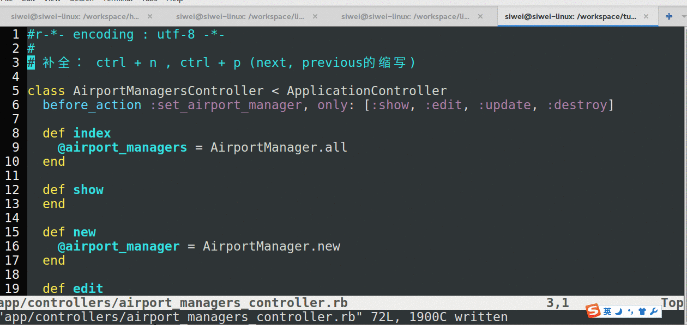

# 第一课

原创不容易. 制作gif图,断断续续花了2,3天.   发布在慕课网花了3小时.  希望能对大家有所帮助!

# 阅读完本文的收获

- 使用键盘进行上下左右
- 3倍提高你的写代码效率
- 告别菜鸟行列，蜕变成一名职业程序员。

# 为什么学习Vim?

世界上只有三种编辑器:  Vim , Emac 和 其他。

Vim的基本功能极其强大。 Vim的插件也无所不包。

官方网站: http://www.vim.org/

# Vim 很好学，二周就可以适应了。

有朋友把各种编辑器的学习曲线放在了一起比较:



这是个笑话，大家不用怕。 Vim其实很好学。 我已经帮你把环境搭建好了。

按照以往的经验，如果你的键盘指法标准，那么2周左右就可以很熟悉了。

# 不适合指法不好的同学。

Vim的每个键都是需要盲打的。 所以，指法不好的同学，赶紧提高自己的指法啊。否则很难的。


# 安装

## Ubuntu：

`$ apt-get install vim`

## Mac:

- 安装 Homebrew:  http://brew.sh
- `$ brew update`
- `$ brew install vim && brew install macvim`

## Windows:

如果你不是C#开发人员，放弃 Windows操作系统吧。拥抱Linux，工资涨3K。
[直接安装Win7 + Ubuntu双系统](http://www.imooc.com/article/12957)

## 运行Vim

安装完毕后， 如果能看到下列的屏幕，说明你安装成功了：



# 安装Vim的插件。

Vim 中有无数种插件，你可以随意安装使用。 可以在 http://www.vim.org/scripts/ 搜索到，也可以直接google。

Vim的插件，可以手动安装， 但是现在已经出现了自动安装插件的工具（Vundle等）。只要你有一个 配置文件， Vundle就会自动帮你安装。

## 下载配置好的配置文件

大家先到我的github上下载这个项目： https://github.com/sg552/my_vim  。我用这个配置文件已经6年多了。常见的功能都覆盖了。

```

$ git clone https://github.com/sg552/my_vim.git
# 下载完毕后，把这两个文件copy到 home 目录就可以了。
$ cp .vimrc ~
$ cp .vim ~ -r
```

## 运行Vundle 来安装各种插件

先进入到Vim:
```

$ vim
```

有可能会报几个错误，没关系。这是由于我们缺少几个plugin 造成的。出一次错误按一次回车就可以了。等到进入到Vim界面后，输入：

```

(注意冒号不要省略，输入冒号才可以进入到命令模式）
:BundleInstall
```

就会自动安装好所有的vim 插件。如下图：


现在，我们就准备好了。

# 基本功

Vim有三种模式：

1. 导航(navigation)模式。  这时候，字母就是上下左右键。
2. 输入模式。这时候，你按字母键，才会输入字母。
3. 命令模式。需要先输入":" 冒号，才会进入。例如，你输入 :ls , 就相当于运行了 `ls` 命令。

## 三个模式的切换

默认的就是导航模式。 你在其他模式下，按"ESC"就回到了导航模式。

在导航模式下，输入 `a`, `i`, `o`等，就可以进入到输入模式。

在导航模式下，输入 `:` 就可以进入到命令模式。

所以，在用Vim的时候，大家用ESC 会用的非常多。

（顺带提一句，用Vim的时候， 盲打是基础，所以，`j`,`f`, 左右`ctrl`, 都是你长在手上的眼睛。 务必熟悉它们的位置。)

## 上下左右

- `h` 左
- `j` 下
- `k` 上
- `l`  右

用这四个键的原因是： 所有人的右手食指都应该放在 j 上。 j 和 f 是最容易摸到的两个键了。所以，jhkl 就理所当然的成为 上下左右了。

这是所有同学都觉得最震撼的一幕。 有了它，标志着你踏入了职业程序员的关键一步。(Emac中的导航也是一样的）


## 下一个词，上一个词

- `w`: 下一个词。  (word)
- `b`: 上一个词。  (backword)

所以，大家要记住，按一下`w` 相当于按多下`l`.


## 向下一屏，向上一屏。

`ctrl + f`:  向下一屏（f = forward)
`ctrl + b`: 向上一屏（b = backward)


## 选择多行

`shift + v`， 然后上下移动。


(你也可以 直接 `v`然后上下左右移动， 这也是选择多行，只是不是整行整行的选择。动手试一下吧！)

## 搜索

搜索 some_thing:  `/some_thing`
继续搜索下一个： `n`
搜索前一个： `shift + n`


## 在当前整个文件中，替换(也叫全局替换）

`:%s/原来的字符串/新字符串/`


（如果某个字符串在某一行出现了多次，希望对它所有出现的次数都替换的话，就在末尾加个`g` ，像这样：    `:%s/原来的字符串/新字符串/g` )

## 局部替换

1. 先 `shift + v` 选中若干行
2. `:s/原来的/新的字符串`



## 代码补全

- `ctrl + n` : 下一个候选
- `ctrl + p` : 上一个候选



# 注意：要有个好键盘。

几十块的键盘，放一边吧。虽然所有的公司都会给你配30块钱的鼠标键盘，但是你要对自己好一些。职业程序员起码买个青轴机械键盘。京东的一款130多块的键盘就很好。

Mac键盘不好。扁扁平平，那是给咖啡厅里的文艺青年用的。（提一句，我见到几乎所有iOS程序员的键盘水平都不好。我认为这跟 Mac 笔记本键盘有直接原因。还是忍痛换了吧, 各位iOS兄弟们。

